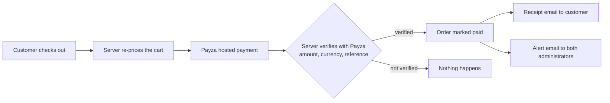
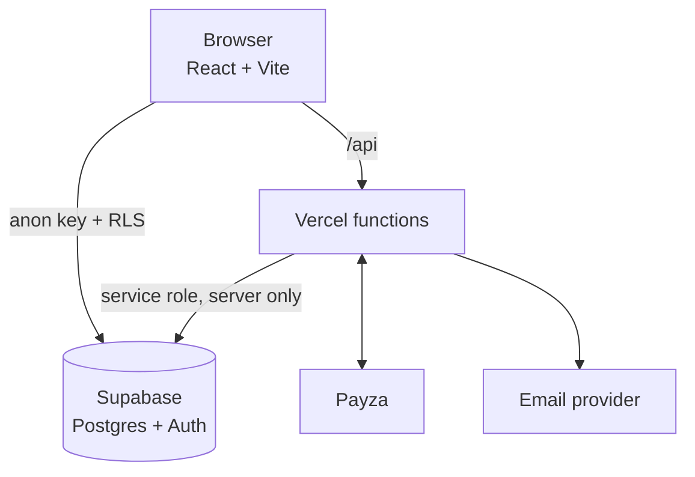

<div align="center">


<br>

[](https://sourcednexus.online)
[](https://sourcednexus.online)
[](docs/DATABASE.md)
[](LICENSE)


</div>

## What is Sourced Nexus?

A product sourcing and online retail website for customers in **Zambia**. Browse fashion, footwear, home items and gadgets, pay online in **Zambian Kwacha**, or ask the team to **source something that is not listed**.

- Live site: **https://sourcednexus.online**
- Contact: sourcednexus@gmail.com, WhatsApp 0573575734 (Lusaka, Zambia)

## Highlights

| | |
|---|---|
| **Shop** | Catalogue with categories, grades, search, wishlist, reviews and likes |
| **Bundles** | Curated sets at one fixed price; every included item and size is recorded |
| **Size verification** | Clothing needs a confirmed size at checkout, enforced by the server |
| **Source for me** | Request any item; get a quote before you pay anything |
| **Secure payments** | Payza checkout in ZMW, confirmed server side before an order counts as paid |
| **Receipts and alerts** | Customer receipt by email; both administrators are alerted on every verified payment |
| **Messaging** | Chat with the team about products and orders |
| **Mobile first** | Fixed bottom navigation on phones, cart count and unread inbox marker |
| **Admin panel** | Products, bundles, orders, inbox, moderation, announcements and analytics |
| **Motion** | Subtle brand animation that respects the "reduce motion" setting |

## How a payment stays safe



The browser can never set a price or declare a payment successful. Duplicate webhooks never create a second order, receipt or email, and a failed email never undoes a paid order. Details in [Payments](docs/PAYMENTS.md).

## Architecture at a glance



## Documentation

| Guide | What it covers |
|---|---|
| [Architecture](docs/ARCHITECTURE.md) | Stack, folders, how the pieces fit together |
| [Features](docs/FEATURES.md) | Every customer and admin feature, with routes |
| [Payments](docs/PAYMENTS.md) | Payza checkout, webhook, receipts, admin payment emails |
| [Database](docs/DATABASE.md) | Tables, functions, security, migration order |
| [Deployment](docs/DEPLOYMENT.md) | Vercel, Supabase, environment variables, cron jobs |
| [Operations](docs/OPERATIONS.md) | Admin tasks, troubleshooting, security checklist |
| [Testing](docs/TESTING.md) | How to run the test suites |

## Quick start

```bash
npm install
cp .env.example .env     # fill in the values, see docs/DEPLOYMENT.md
npm run dev              # http://localhost:5173
```

| Command | Purpose |
|---|---|
| `npm run dev` | Vite dev server |
| `npm run build` | Production build into `dist/` |
| `npm start` | Node server (`server.js`) serving the build and the API |
| `npm run lint` / `npm run typecheck` | Code checks |

## Tech stack

React 18, Vite 6, Tailwind CSS 3, shadcn/ui (Radix), React Router, TanStack Query, Supabase (Postgres, Auth, Row Level Security), Payza, Vercel (hosting and cron), Cloudflare Turnstile.

## Security

Secrets live only in server environment variables. Row Level Security is on for every table, and orders, payments and receipts can only be written by the server. Please report security issues privately to sourcednexus@gmail.com instead of opening a public issue.

## Licence

Apache License 2.0. See [LICENSE](LICENSE).

<div align="center">
<sub>Made in Lusaka, Zambia</sub>
</div>
